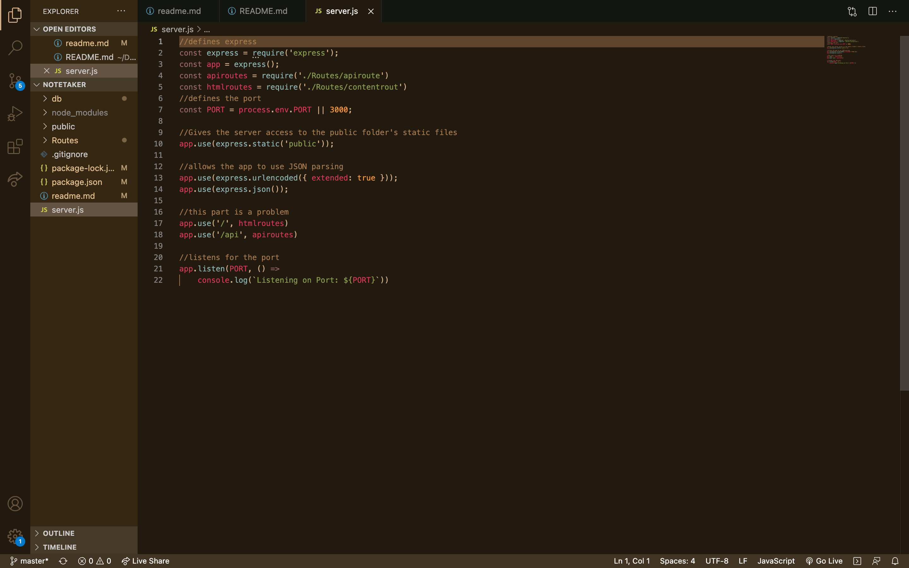

#  Note Taker 
With this assignment I had to add a server connection and routes to make a starter file work. The end product is supposed to use routes on a locally hosted server to deliver an HTML page, then recieve a text input, parse to JSON and save to a .json file. These saved objects show up on the html page and can be deleted, and read at any time, with all the saved values remaining after the server closes to be accessed later.

# Tech used
JavaScript

# How to use
Open the directory in the terminal, then run npm install. after the install run node server.js and the terminal will tell you the app is running on the displayed port. go to your default browser and type localhost:{PORT} into the address bar.

# Problems
My biggest problem with this project was getting the API route to call. I spent days on this issue only to have it be a '*' instead of a '/' in my HTML route that fixed the whole app.

# Meat and Potatoes 

